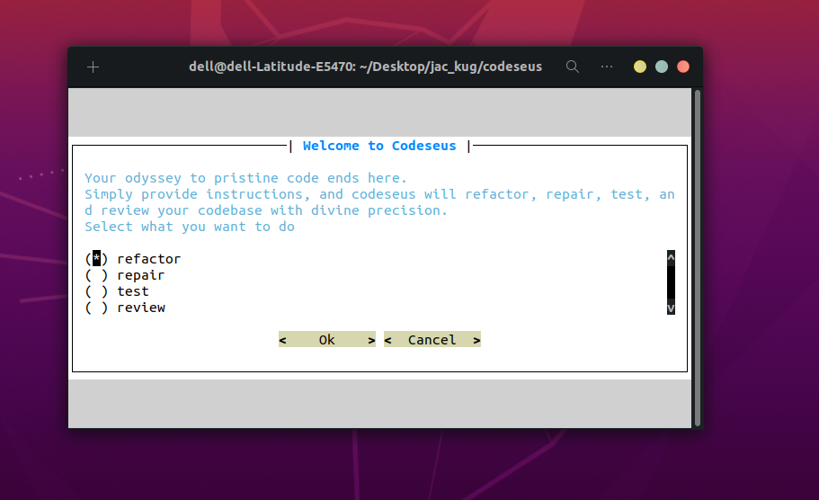
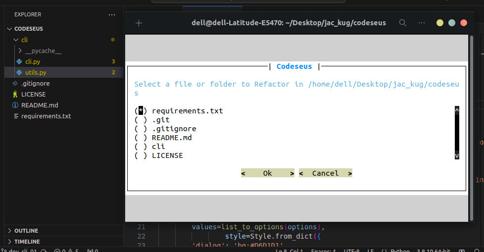

## Command-line interface (CLI) for Codeseus

- Allows users to select actions like:
  - Refactoring
  - Repairing
  - Testing
  - Reviewing code

- Prompts users to navigate through directories and select specific files or folders.

 

